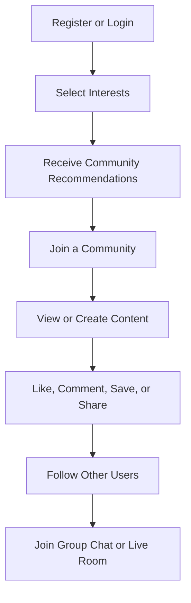

# 1. Overview & Vision

## 1.1 Project Idea

**Project Name:** GenZ Media

GenZ Media is a **Social Community Platform** designed to help users:

- Discover people with similar interests
- Create and join topic-based communities
- Publish text posts, images, and short videos
- Follow other users
- Like, comment, save, and share content
- Report inappropriate content
- Participate in group chats within communities
- Join live rooms through an external video service

The main concept of the platform is to connect people through **shared interests and communities** rather than through a traditional friend-request system.

---

## 1.2 Problem the Project Aims to Solve

Many users want an easier way to find:

- People who share similar interests
- Communities that match their interests
- Places to discuss specific topics
- Social connections built around shared interests

GenZ Media focuses on **Community and Shared Interests** as the core of the platform.

---

## 1.3 Goal Statement

> Build a Backend API using Python FastAPI for a Social Community Platform that helps users discover people and communities based on shared interests, publish text posts, images, and short videos, and communicate through Community Group Chat and Live Rooms.

---

## 1.4 Target Users

The platform is designed for general users who want to:

- Find people who enjoy similar topics
- Join topic-based communities
- Share knowledge, experiences, and content
- Follow content creators or other users
- Discuss topics and participate in community activities

Example communities:
- Gaming
- Music
- Football
- Movies
- Books
- Education
- Technology
- Photography
- Travel

---

## 1.5 Unique Value Proposition

The key feature of GenZ Media is not simply *"Short videos like TikTok."*

The platform's main value is:

> **Interest-Based Community Discovery**

The system recommends people, content, and communities based on:

- Interests selected by the user
- Communities the user has joined
- Posts the user has liked
- Content the user has saved
- Types of content the user frequently views
- Users they follow

For the first version, GenZ Media uses a **rule-based recommendation system** instead of AI or Machine Learning:

```text
Recommendation Score =
Shared Interests × 4
+ Shared Communities × 3
+ Similar Content Interactions × 2
+ Following Relationship × 1
```

This approach is easier to implement, test, and explain while still providing useful recommendations.

---

## 1.6 Core User Journey



---

## 1.7 Project Proposal Summary

> **GenZ Media** is a Social Community Backend API developed using Python FastAPI. Its purpose is to help users discover people, content, and communities that match their interests. Users can create profiles, choose interests, follow other users, create or join public and private communities, and publish text posts, images, and short videos.
>
> The platform uses an interest-based recommendation model to recommend content, communities, and users based on selected interests, community memberships, follow relationships, and interactions such as likes, saves, and content views.
>
> GenZ Media also supports content engagement through likes, comments, replies, saves, shares, and reports. Communities provide their own membership system, content space, moderation capabilities, and optional real-time group chat.
>
> For live communication, FastAPI manages Live Room authentication, permissions, sessions, and business logic, while an external provider such as LiveKit or Agora handles actual video and audio streaming.
>
> The backend follows a Modular Monolith architecture using FastAPI, PostgreSQL, Async SQLAlchemy, Alembic, Redis, WebSockets, external media storage, Docker, and Pytest.
>
> The MVP focuses on Authentication, User Profiles, Interests, Follow System, Communities, Content, Engagement, Search, Feed, Recommendations, Notifications, and Moderation. Community Group Chat and Live Room integration are treated as stretch goals to keep the project realistic for a single developer working within approximately one to two months.

---

## 1.8 Final MVP Scope

```text
GenZ Media
│
├── Authentication
│   ├── Register
│   ├── Login
│   ├── Logout
│   ├── Email Verification
│   ├── Forgot/Reset Password
│   └── Access + Refresh Token
│
├── Users
│   ├── Profile
│   ├── Interests
│   ├── Follow
│   └── Block
│
├── Communities
│   ├── Public Community
│   ├── Private Community
│   ├── Membership
│   ├── Join Requests
│   └── Owner Moderation
│
├── Content
│   ├── Text Post
│   ├── Image Post
│   └── Short Video
│
├── Engagement
│   ├── Like
│   ├── Comment
│   ├── Reply
│   ├── Save
│   ├── Share
│   └── Report
│
├── Discovery
│   ├── Home Feed
│   ├── Discover Feed
│   ├── Short Video Feed
│   ├── Search
│   └── Rule-Based Recommendation
│
├── Notifications
│   └── In-App Notifications
│
├── Moderation
│   ├── User Reports
│   ├── Content Reports
│   ├── Community Reports
│   └── System Admin
│
└── Stretch Goals
    ├── Community Group Chat
    └── External Live Room Integration
```

> **Discover people, content, and communities through shared interests.**
