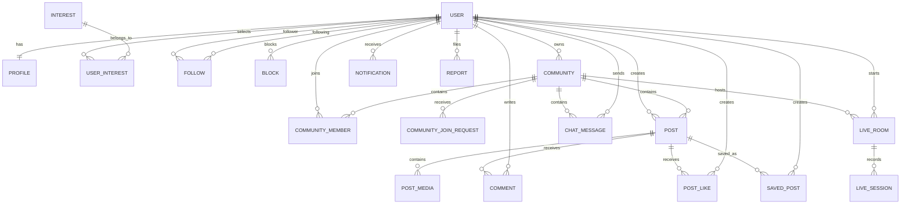

# 4. Database Design & Domain Model

## 4.1 Domain Entities Overview

The database uses PostgreSQL managed with Async SQLAlchemy 2.0+ and Alembic migrations.

### Core Tables & Models

```text
users                      # Base user account and auth credentials
profiles                   # Extended user profile details (avatar, bio, counters)
interests                  # Admin-managed master taxonomy of interests
user_interests             # Many-to-many join table for user-selected interests

follows                    # Directional follow relationships (follower_id, following_id)
blocks                     # User block list (blocker_id, blocked_id)

communities                # Community spaces (public or private)
community_members          # Membership records and roles (Owner, Member)
community_join_requests    # Join requests for private communities

posts                      # Content entries (text, image, short video)
post_media                 # Media assets metadata linked to posts (WebP images, short videos)

post_likes                 # Post likes (user_id, post_id unique pair)
comments                   # Post comments and nested replies
saved_posts                # User bookmarked/saved posts

notifications              # In-app event notifications
reports                    # Flagged users, content, comments, communities, and chat messages

chat_messages              # Community group chat message history

live_rooms                 # Live streaming room metadata & configuration
live_sessions              # Live streaming session history & logs

outbox_events              # Transactional outbox events for asynchronous relay
dead_letter_events         # Failed events exhausted all retries
```

---

## 4.2 Entity-Relationship (ER) Diagram



---

## 4.3 Key Constraints & Indexing Strategy

- **`follows`**: `UNIQUE(follower_id, following_id)` with index on both columns for fast lookup of followers and following.
- **`blocks`**: `UNIQUE(blocker_id, blocked_id)` for preventing duplicate block records.
- **`post_likes`**: `UNIQUE(user_id, post_id)` to ensure an idempotent single like per post.
- **`saved_posts`**: `UNIQUE(user_id, post_id)` for single save record per post.
- **`user_interests`**: `UNIQUE(user_id, interest_id)` ensuring unique interest associations.
- **`community_members`**: `UNIQUE(user_id, community_id)` ensuring single membership per community.
- **`posts`**: Indexes on `author_id`, `community_id`, `created_at`, and `visibility`.
- **`notifications`**: Indexes on `recipient_id`, `actor_id`, `is_read`, and `created_at`.
- **`reports`**: Indexes on `reporter_id`, `target_id`, `community_id`, `status`, and `created_at`, plus a partial unique index preventing duplicate `PENDING`/`REVIEWING` reports per reporter/type/target.
- **`users.token_version`**: Revokes older JWTs after password changes, password resets, and account suspension.
- **`live_sessions`**: A partial unique index allows at most one active (`ended_at IS NULL`) session per room.
- **`provider_events`**: Unique provider/event identity enforces webhook idempotency; `processed_at` is set only after successful routing.
- **`outbox_events`**: Indexes on `aggregate_type`, `event_type`, `created_at`, and `published_at`.
