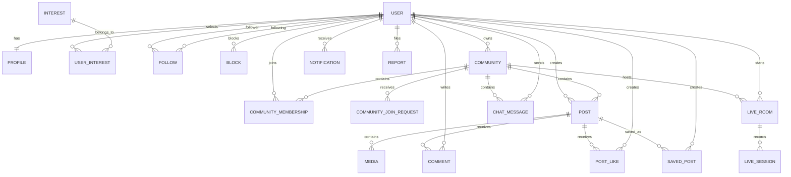

# 4. Database Design & Domain Model

## 4.1 Domain Entities Overview

The database uses PostgreSQL managed with Async SQLAlchemy 2.0+ and Alembic migrations.

### Core Tables & Models

```text
users                      # Base user account and auth credentials
profiles                   # Extended user profile details (avatar, bio, counters)
interests                  # Admin-managed master taxonomy of interests
user_interests             # Many-to-many join table for user-selected interests

follows                    # Directional follow relationships (follower_id, following_id)
blocks                     # User block list (blocker_id, blocked_id)

communities                # Community spaces (public or private)
community_memberships      # Membership records and roles (Owner, Member)
community_join_requests    # Join requests for private communities

posts                      # Content entries (text, image, short video)
media                      # Media assets metadata linked to posts

post_likes                 # Post likes (user_id, post_id unique pair)
comments                   # Post comments and nested replies
saved_posts                # User bookmarked/saved posts

notifications              # In-app event notifications
reports                    # Flagged users, content, comments, communities

chat_messages              # Community group chat message history

live_rooms                 # External live room metadata & configuration
live_sessions              # Live streaming session history & logs
```

---

## 4.2 Entity-Relationship (ER) Diagram



---

## 4.3 Key Constraints & Indexing Strategy

- **`follows`**: `UNIQUE(follower_id, following_id)` with index on both columns for fast lookup of followers and following.
- **`post_likes`**: `UNIQUE(user_id, post_id)` to ensure an idempotent single like per post.
- **`saved_posts`**: `UNIQUE(user_id, post_id)` for single save record per post.
- **`user_interests`**: `UNIQUE(user_id, interest_id)`.
- **`community_memberships`**: `UNIQUE(user_id, community_id)`.
- **`posts`**: Indexes on `author_id`, `community_id`, `created_at`, and `visibility`.
