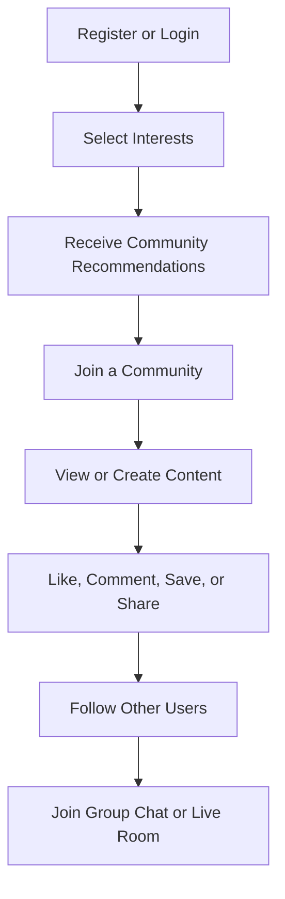
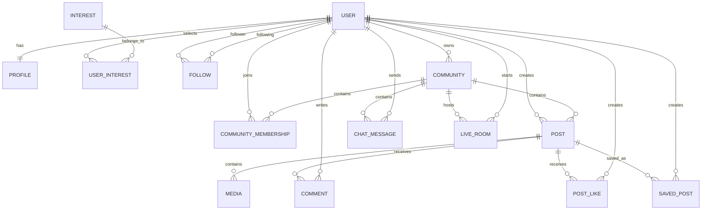

# GenZ Media

# 1. Project Idea

**Temporary Project Name:** GenZ Media

GenZ Media is a **Social Community Platform** designed to help users:

- Discover people with similar interests
- Create and join topic-based communities
- Publish text posts, images, and short videos
- Follow other users
- Like, comment, save, and share content
- Report inappropriate content
- Participate in group chats within communities
- Join live rooms through an external video service

The main concept of the platform is to connect people through **shared interests and communities** rather than through a traditional friend-request system.

# 2. Problem the Project Aims to Solve

Many users want an easier way to find:

- People who share similar interests
- Communities that match their interests
- Places to discuss specific topics
- Social connections built around shared interests

GenZ Media will focus on **Community and Shared Interests** as the core of the platform.

# 3. Goal Statement

> Build a Backend API using Python FastAPI for a Social Community Platform that helps users discover people and communities based on shared interests, publish text posts, images, and short videos, and communicate through Community Group Chat and Live Rooms.

# 4. Target Users

The platform is designed for general users who want to:

- Find people who enjoy similar topics
- Join topic-based communities
- Share knowledge, experiences, and content
- Follow content creators or other users
- Discuss topics and participate in community activities

Example communities:

- Gaming
- Music
- Football
- Movies
- Books
- Education
- Technology
- Photography
- Travel

# 5. Unique Value Proposition

The key feature of GenZ Media is not simply:

> “Short videos like TikTok.”

The platform's main value is:

> **Interest-Based Community Discovery**

The system recommends people, content, and communities based on:

- Interests selected by the user
- Communities the user has joined
- Posts the user has liked
- Content the user has saved
- Types of content the user frequently views
- Users they follow

For the first version, GenZ Media should use a **rule-based recommendation system** instead of AI or Machine Learning.

Example:

```text
Recommendation Score =
Shared Interests × 4
+ Shared Communities × 3
+ Similar Content Interactions × 2
+ Following Relationship × 1
```

This approach is easier to implement, test, and explain while still providing useful recommendations.

# 6. Core User Journey



# 7. MVP Features

## 7.1 Authentication

The authentication system should support:

- Register
- Login
- Logout
- Email verification
- Forgot Password
- Reset Password
- JWT Access Token
- Refresh Token
- Change Password

Authentication should use JWT-based access and refresh tokens.

## 7.2 User Profile

Users can:

- View a profile
- Edit their profile
- Upload an avatar
- Write a bio
- Select interests
- View their own posts
- View followers
- View following
- Follow or unfollow other users
- Block or unblock other users

A user profile should contain basic information such as:

- Username
- Display name
- Bio
- Avatar
- Selected interests
- Follower count
- Following count
- Post count

## 7.3 Follow System

The platform uses a **Follow System** instead of a Friend Request System.

Users can:

- Follow another user
- Unfollow another user
- View followers
- View following
- Check whether they are following another user
- Receive a notification when someone follows them

The relationship is directional.

```text
User A follows User B
```

This means User A follows User B, but User B does not need to follow User A back.

However, User B can choose to follow User A.

If both users follow each other:

```text
User A → follows → User B
User B → follows → User A
```

These are still two separate follow relationships rather than a single friendship relationship.

This model makes the database structure and API simpler than a Friend Request System.

## 7.4 Interests

The system can provide predefined interests managed by the System Admin.

Examples:

- Technology
- Programming
- Gaming
- Music
- Sport
- Education
- Movies
- Art
- Photography
- Travel

Users can:

- Select interests during onboarding
- Add interests later
- Remove interests
- Receive content recommendations based on interests
- Receive community recommendations based on interests
- Discover users with similar interests

Interests should be represented as reusable entities rather than free-form text entered by every user.

## 7.5 Community

Every user can create a community.

There are two community types:

| Type | Joining Method |
| --- | --- |
| Public | Users can join immediately |
| Private | Users must submit a join request and wait for approval from the Community Owner |

A community has two main roles:

| Role | Permissions |
| --- | --- |
| Owner | Manage the community, members, and community content |
| Member | View and create content inside the community |

The Community Owner can:

- Edit community information
- Upload a community cover image
- View join requests
- Approve join requests
- Reject join requests
- Remove members
- Delete inappropriate posts
- Delete messages from the community group chat
- Start a Live Room
- End a Live Room

A user becomes the `Owner` automatically when creating a community.

Other users become `Members` after joining the community.

## 7.6 Content

The platform supports three primary content types.

### Text Post

A Text Post can contain:

- Title
- Content
- Visibility
- Community ID if posted inside a community

Example:

```json
{
  "type": "TEXT",
  "title": "Learning FastAPI",
  "content": "What is the best way to organize a large FastAPI project?",
  "visibility": "PUBLIC",
  "community_id": null
}
```

### Image Post

An Image Post can contain:

- Caption
- One or more images
- Visibility
- Community ID

Example:

```json
{
  "type": "IMAGE",
  "caption": "Beautiful sunset today.",
  "visibility": "PUBLIC",
  "community_id": 10
}
```

Image files should be stored through the Media system rather than directly inside PostgreSQL.

### Short Video Post

A Short Video Post can contain:

- Caption
- Video
- Thumbnail
- Duration
- Visibility
- Community ID

Example:

```json
{
  "type": "SHORT_VIDEO",
  "caption": "My coding setup",
  "video_url": "...",
  "thumbnail_url": "...",
  "duration": 32,
  "visibility": "PUBLIC",
  "community_id": null
}
```

Users can publish content in:

- Their personal profile
- Communities where they are members

A post should belong to only one location.

```text
Personal Post
community_id = null
```

```text
Community Post
community_id = Community ID
```

This approach makes permission handling and content ownership easier to manage.

## 7.7 Engagement

Users can interact with content through the following features:

- Like a post
- Unlike a post
- Comment on a post
- Reply to a comment
- Edit their own comment
- Delete their own comment
- Save a post
- Unsave a post
- Share a post through a link
- Report a post
- Report a comment
- Report a user

### Like

One user should only be able to like the same post once.

Example constraint:

```text
UNIQUE(user_id, post_id)
```

### Save

Saved posts should be private to the user.

Other users do not need to know who saved a post.

### Share

For the MVP, `Share` should only:

- Generate or copy a shareable link
- Optionally increase the post's share count

A complete repost system is not required in the first version.

## 7.8 Feed

The platform should provide three primary feeds.

### Home Feed

The Home Feed displays:

- Posts from users the current user follows
- Posts from communities the current user has joined
- Recent posts related to the user's interests

A basic ranking approach could use:

```text
Feed Score =
Interest Match
+ Following Relationship
+ Community Membership
+ Engagement Score
+ Recency Score
```

### Discover Feed

The Discover Feed displays:

- Recommended communities
- Users with similar interests
- Popular posts
- Content related to the user's interests

The goal is to help the user discover content outside their existing network.

### Short Video Feed

The Short Video Feed displays short videos based on:

- User interests
- Like history
- Save history
- Community membership
- Popularity
- Recency

For the MVP, a simple weighted scoring algorithm is enough.

Machine Learning is not required.

## 7.9 Search

Users can search for:

- Users by name
- Users by username
- Communities by name
- Posts by title
- Posts by content
- Interests by name

For the MVP, search can initially use:

- PostgreSQL `ILIKE`
- PostgreSQL Full-Text Search

Example:

```sql
SELECT *
FROM users
WHERE username ILIKE '%python%';
```

A dedicated search engine such as Elasticsearch or OpenSearch is not required for the MVP.

## 7.10 Community Group Chat

Community Group Chat should use **FastAPI WebSockets** for real-time communication.

Features:

- Community members can join the chat room
- Members can send text messages
- Members can view message history
- Users can delete their own messages
- Community Owners can delete messages
- The system can display the number of online users
- Users who leave the community can no longer access its chat room

Example communication flow:

```text
Client
   ↓
WebSocket Connection
   ↓
FastAPI
   ↓
Permission Check
   ↓
Community Chat Room
   ↓
Broadcast Message
```

For the MVP, the following features are not required:

- Voice messages
- Video messages
- Message reactions
- Read receipts
- Typing indicators

These can be added in Phase 2.

## 7.11 Live Room

FastAPI should **not handle raw video streaming directly**.

Instead, FastAPI should manage the business logic around live sessions.

FastAPI is responsible for:

- Creating a Live Room
- Generating access tokens
- Starting a live session
- Joining a live session
- Leaving a live session
- Ending a live session
- Assigning the host
- Linking the Live Room to a community
- Managing permissions
- Tracking viewer count
- Handling live comments
- Storing Live Session history

An external service is responsible for:

- Video streaming
- Audio streaming
- Real-time media connections
- Video quality adaptation
- Media delivery

Possible services include:

- LiveKit
- Agora
- Cloudflare Stream

Example architecture:

```text
Frontend
   │
   ├── REST API / WebSocket
   │
   ▼
FastAPI Backend
   │
   ├── Authentication
   ├── Permissions
   ├── Live Room Management
   └── Generate Video Service Token
             │
             ▼
       LiveKit / Agora
             │
             ▼
      Video + Audio Stream
```

For a project with a development period of approximately 1–2 months, Live Room integration should be treated as a **Stretch Goal**.

The Core API should be completed before beginning Live integration.

## 7.12 Notifications

Users can receive notifications when:

- Someone follows them
- Someone likes their post
- Someone comments on their post
- Someone replies to their comment
- Their join request is accepted
- Their join request is rejected
- A new post is published in a joined community
- A community starts a Live Room

For the MVP, notifications should be implemented as **in-app notifications stored in the database**.

Push notifications are not required initially.

Example notification:

```json
{
  "type": "POST_LIKED",
  "actor_id": 25,
  "receiver_id": 10,
  "entity_id": 100,
  "is_read": false
}
```

Users should also be able to:

- View notifications
- Mark a notification as read
- Mark all notifications as read

## 7.13 Report and Moderation

Users can report:

- User
- Post
- Comment
- Community
- Chat Message

A report can have one of the following statuses:

```text
PENDING
REVIEWING
RESOLVED
REJECTED
```

A report should contain information such as:

```text
reporter_id
target_type
target_id
reason
description
status
created_at
```

The System Admin can:

- View reports
- Review reports
- Resolve reports
- Reject reports
- Delete inappropriate content
- Suspend users
- Ban users
- Close communities

The system must clearly separate:

### System Admin

Responsible for managing the entire GenZ Media platform.

Permissions can include:

- User moderation
- Community moderation
- Report review
- Platform-wide content removal
- Interest management
- User suspension
- User banning

### Community Owner

Responsible only for managing their own community.

Permissions can include:

- Community information management
- Membership management
- Community post moderation
- Community chat moderation
- Community Live Room management

A Community Owner should not have platform-wide administrative permissions.

# 8. Feature Priority

| Priority | Features |
| --- | --- |
| P0 — Required | Authentication, Profile, Interests, Follow, Community |
| P0 — Required | Text/Image/Video Post, Like, Comment |
| P1 — Important | Save, Share, Report, Search, Feed |
| P1 — Important | Basic Recommendations and Notifications |
| P2 — Stretch Goal | Community Group Chat |
| P2 — Stretch Goal | External Live Integration |

The project should prioritize completing all `P0` features before moving to `P1` or `P2`.

# 9. Features Excluded from the MVP

Because this project is intended to be built within approximately 1–2 months by a single backend developer, the MVP should not include:

- Friend Request System
- Stories
- Personal Direct Messages
- Video Calls
- Advanced AI Recommendation
- Machine Learning Recommendation
- Payment System
- Monetization
- Advertising System
- Automatic AI Moderation
- Built-in Video Editor
- Self-hosted Video Streaming Server
- Microservices Architecture

Removing these features helps keep the project achievable while still demonstrating strong backend engineering concepts.

# 10. Backend Modules

A package-by-feature structure can be used.

```text
app/
├── auth/
├── users/
├── profiles/
├── interests/
├── follows/
├── communities/
├── memberships/
├── posts/
├── media/
├── comments/
├── reactions/
├── saved_posts/
├── reports/
├── feeds/
├── recommendations/
├── notifications/
├── chats/
├── live_rooms/
└── core/
```

Each module can contain its own:

```text
module/
├── router.py
├── schemas.py
├── models.py
├── service.py
├── repository.py
└── dependencies.py
```

For example:

```text
app/
├── auth/
│   ├── router.py
│   ├── schemas.py
│   ├── service.py
│   └── dependencies.py
│
├── users/
│   ├── router.py
│   ├── models.py
│   ├── schemas.py
│   ├── service.py
│   └── repository.py
│
├── posts/
│   ├── router.py
│   ├── models.py
│   ├── schemas.py
│   ├── service.py
│   └── repository.py
│
└── core/
    ├── config.py
    ├── database.py
    ├── security.py
    └── exceptions.py
```

For this project, a **Modular Monolith** architecture should be used.

Microservices would introduce unnecessary complexity for the current project size.

# 11. Technology Stack

## Backend

- Python
- FastAPI
- Pydantic

## Database

- PostgreSQL
- Async SQLAlchemy
- Alembic

## Authentication

- JWT Authentication
- Access Token
- Refresh Token
- Password hashing

## Real-Time Communication

- FastAPI WebSocket
- Redis for presence and potentially Pub/Sub

## Media Storage

Use an external object-storage or media service such as:

- Amazon S3
- Cloudflare R2
- MinIO
- Cloudinary

Media files should not be stored directly inside PostgreSQL.

PostgreSQL should only store metadata and URLs.

Example:

```text
posts
    id
    author_id
    type
    caption

media
    id
    post_id
    media_type
    url
    thumbnail_url
    size
    duration
```

## Live Video

Possible external providers:

- LiveKit
- Agora
- Cloudflare Stream

## Testing

- Pytest
- FastAPI TestClient or HTTPX
- Test database

## Development and Deployment

- Docker
- Docker Compose
- Environment variables
- PostgreSQL container
- Redis container

## API Documentation

FastAPI provides:

- Swagger UI
- OpenAPI
- ReDoc

# 12. Development Roadmap

| Week | Work |
| --- | --- |
| Week 1 | Project setup, Database, Authentication, User Profile |
| Week 2 | Interests, Follow System, Community |
| Week 3 | Membership and Community Permissions |
| Week 4 | Posts, Image/Video Upload, Comments |
| Week 5 | Like, Save, Share, Reports, Notifications |
| Week 6 | Feed, Search, Rule-Based Recommendations |
| Week 7 | Community Group Chat and Testing |
| Week 8 | Live Integration, Documentation, Deployment |

Live Integration should only begin after the features from Weeks 1–6 are working correctly.

If development falls behind schedule, prioritize:

```text
Auth
↓
Users
↓
Interests
↓
Follow
↓
Community
↓
Posts
↓
Comments
↓
Engagement
↓
Feed/Search
```

Then implement:

```text
Notifications
↓
Group Chat
↓
Live Room
```

# 13. Recommended Database Domain Model

The main database entities can include:

```text
users
profiles
interests
user_interests

follows
blocks

communities
community_memberships
community_join_requests

posts
media

post_likes
comments
saved_posts

notifications
reports

chat_messages

live_rooms
live_sessions
```

A simplified relationship overview:



# 14. Recommended API Structure

A possible API structure:

```text
/api/v1/auth
/api/v1/users
/api/v1/profiles
/api/v1/interests
/api/v1/follows
/api/v1/communities
/api/v1/posts
/api/v1/comments
/api/v1/reactions
/api/v1/saved-posts
/api/v1/reports
/api/v1/feeds
/api/v1/search
/api/v1/recommendations
/api/v1/notifications
/api/v1/chats
/api/v1/live-rooms
```

Example endpoints:

```http
POST   /api/v1/auth/register
POST   /api/v1/auth/login
POST   /api/v1/auth/refresh
POST   /api/v1/auth/logout

GET    /api/v1/users/{username}
GET    /api/v1/users/{user_id}/followers
GET    /api/v1/users/{user_id}/following

POST   /api/v1/users/{user_id}/follow
DELETE /api/v1/users/{user_id}/follow

GET    /api/v1/interests
PUT    /api/v1/users/me/interests

POST   /api/v1/communities
GET    /api/v1/communities/{community_id}
POST   /api/v1/communities/{community_id}/join
DELETE /api/v1/communities/{community_id}/leave

POST   /api/v1/posts
GET    /api/v1/posts/{post_id}
DELETE /api/v1/posts/{post_id}

POST   /api/v1/posts/{post_id}/like
DELETE /api/v1/posts/{post_id}/like

POST   /api/v1/posts/{post_id}/comments
GET    /api/v1/posts/{post_id}/comments

POST   /api/v1/posts/{post_id}/save
DELETE /api/v1/posts/{post_id}/save

GET    /api/v1/feeds/home
GET    /api/v1/feeds/discover
GET    /api/v1/feeds/shorts

GET    /api/v1/search

GET    /api/v1/notifications
PATCH  /api/v1/notifications/{notification_id}/read

POST   /api/v1/reports
```

The exact endpoint design should be finalized during the API specification phase.

# 15. Core Backend Rules

The backend should enforce several important business rules.

### Follow

```text
A user cannot follow themselves.
A user cannot create the same follow relationship twice.
Following does not require approval.
Unfollowing immediately removes the relationship.
```

### Community

```text
A Community Owner is automatically a member.
A user cannot join the same community twice.
A private community requires approval.
A public community does not require approval.
Only the Owner can manage community members.
```

### Posts

```text
A personal post has community_id = null.
A community post must have a valid community_id.
A user must be a member to create a community post.
```

### Comments

```text
A user can edit only their own comment.
A user can delete only their own comment.
A Community Owner can moderate comments inside their community.
A System Admin can moderate comments platform-wide.
```

### Group Chat

```text
Only community members can connect to the community chat.
Users who leave the community immediately lose chat access.
Community Owners can moderate chat messages.
```

### Blocking

If User A blocks User B:

```text
User B cannot follow User A.
User B cannot interact with User A's content where restricted.
Existing follow relationships between them should be removed.
```

The exact privacy behavior can be refined later.

# 16. Architecture Recommendation

GenZ Media should use a:

> **Modular Monolith Architecture**

A simplified architecture:

```text
Client Application
        │
        ▼
    FastAPI API
        │
        ├── Authentication
        ├── Users
        ├── Communities
        ├── Content
        ├── Engagement
        ├── Feed
        ├── Chat
        └── Live Room Management
        │
        ▼
 Service / Business Logic Layer
        │
        ▼
 Repository / Data Access Layer
        │
        ▼
 PostgreSQL
```

Supporting infrastructure:

```text
FastAPI
   │
   ├── PostgreSQL
   │
   ├── Redis
   │
   ├── Object Storage / Cloudinary
   │
   └── LiveKit / Agora
```

This architecture keeps the project manageable while still allowing individual modules to be separated into services later if the platform grows significantly.

# 17. Project Proposal Summary

> **GenZ Media** is a Social Community Backend API developed using Python FastAPI. Its purpose is to help users discover people, content, and communities that match their interests. Users can create profiles, choose interests, follow other users, create or join public and private communities, and publish text posts, images, and short videos.
>
> The platform uses an interest-based recommendation model to recommend content, communities, and users based on selected interests, community memberships, follow relationships, and interactions such as likes, saves, and content views.
>
> GenZ Media also supports content engagement through likes, comments, replies, saves, shares, and reports. Communities provide their own membership system, content space, moderation capabilities, and optional real-time group chat.
>
> For live communication, FastAPI manages Live Room authentication, permissions, sessions, and business logic, while an external provider such as LiveKit or Agora handles actual video and audio streaming.
>
> The backend will follow a Modular Monolith architecture using FastAPI, PostgreSQL, Async SQLAlchemy, Alembic, Redis, WebSockets, external media storage, Docker, and Pytest.
>
> The MVP focuses on Authentication, User Profiles, Interests, Follow System, Communities, Content, Engagement, Search, Feed, Recommendations, Notifications, and Moderation. Community Group Chat and Live Room integration are treated as stretch goals to keep the project realistic for a single developer working within approximately one to two months.

# 18. Final MVP Scope

The recommended final scope is:

```text
GenZ Media
│
├── Authentication
│   ├── Register
│   ├── Login
│   ├── Logout
│   ├── Email Verification
│   ├── Forgot/Reset Password
│   └── Access + Refresh Token
│
├── Users
│   ├── Profile
│   ├── Interests
│   ├── Follow
│   └── Block
│
├── Communities
│   ├── Public Community
│   ├── Private Community
│   ├── Membership
│   ├── Join Requests
│   └── Owner Moderation
│
├── Content
│   ├── Text Post
│   ├── Image Post
│   └── Short Video
│
├── Engagement
│   ├── Like
│   ├── Comment
│   ├── Reply
│   ├── Save
│   ├── Share
│   └── Report
│
├── Discovery
│   ├── Home Feed
│   ├── Discover Feed
│   ├── Short Video Feed
│   ├── Search
│   └── Rule-Based Recommendation
│
├── Notifications
│   └── In-App Notifications
│
├── Moderation
│   ├── User Reports
│   ├── Content Reports
│   ├── Community Reports
│   └── System Admin
│
└── Stretch Goals
    ├── Community Group Chat
    └── External Live Room Integration
```

The central concept remains:

> **Discover people, content, and communities through shared interests.**